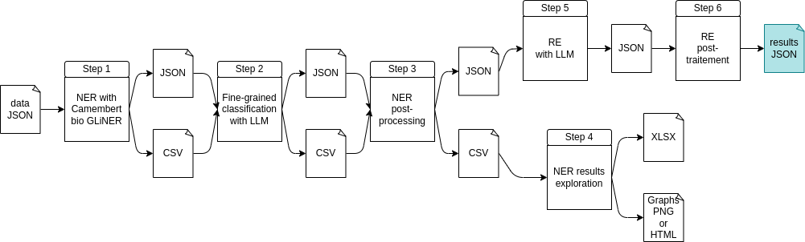

# EvalLLM2025 Information extraction challenge - Combined approach

## Table of Contents
- [Description](#description)
- [Prerequisites](#prerequisites)
- [Data exploration](#data-exploration)
    - [Installation](#installation)
    - [Run](#run)
- [Combined approach](#combined-approach)
    - [Workflow](#workflow)
    - [Install pipeline](#install-pipeline)
    - [Configuration file](#configuration-file)
    - [Run pipeline](#run-pipeline)
    - [LLM prompts](#llm-prompts)

## Description
This repository contains our work for the [EvalLLM2025 challenge](https://evalllm2025.sciencesconf.org/resource/page/id/5) about information extraction on Named Entity Recognition (NER) and Relationship Extraction (RE).

We began with an **exploratory data analysis** phase to better understand the training dataset.

Then, we worked on **two appoaches**:
- a **LLM-only approach** (see [this repository](https://github.com/LucieBader/Challenge_EvalLLM2025)),
- a **combined approach** leveraging CamemBERT-bio-GLiNER for initial entity recognition, followed by a small LLM for fine-grained classification.

## Prerequisites

⚠️ **Training and test datasets are not provided in the repository.** They should be manually added to the `data/` folder, in either `train_data/` or `test_data/`, as appropriate.

## Data exploration
Data exploration code can be found in the `data_exploration/` folder.

### Installation
1. Create a Conda environment or a venv:
```bash
cd data_exploration/
conda create -n challenge_evalllm2025 python=3.12.9
conda activate challenge_evalllm2025
```

2. Install requirements:
```bash
pip install -r requirements.txt
```

3. Dowload SpaCy model (to count tokens):
```bash
python -m spacy download fr_core_news_sm
```

### Run
1. The Jupyter notebook `data_exploration.ipynb` can be used to generate statistics **on the training dataset** (**or on the test dataset**, although not all images will be generated in that case). The resulting images are saved in the `training_data__images/` directory and a .csv file is also generated.

2. The Python script `plot_document_graphes.py` can be used to generate a network graph for each event in every document (i.e., one graph per document-event pair). This step is limited to the **training dataset**, since entities and their labels are not available in the test dataset. The resulting images are saved in the `training_data__images/documents_graphes/` directory. A .txt file is also created, containing the number of entities for each event.

## Combined approach
Combined approach pipeline can be found in the `combined_approach_pipeline/` folder.

### Workflow


The pipeline will produce **logs** and will also generate, for each step, **temporary files** in JSON and CSV format in the predictions path (see the parameter `predictions_path` in `config.yml` file). The **result** of the pipeline is the output of step 6 and can be found in `predictions/predictions_{timestamp}/{timestamp}_predictions_last_version.json`.

The following steps are performed:
1. **NER with Camembert bio GLiNER** and a simplified list of labels. The model will find entities and attribute a label.
2. **Fine-grained classification with LLM** to specify labels previously predicted. For test dataset, the non-merged labels will be mapped (e.g., it will convert *Lieu* in *LOCATION*) and the merged labels (*Maladie*, *Date* and *Periode*) will be refine by requesting a LLM. For training dataset, it is possible to do a mapping to have results.
3. **NER post-processing** to :
    - correct start and end positions if needed ;
    - retrieve all mentions of the same entity in the text ;
    - add unique ids ;
    - handle the non-overlapping of entities.
4. **NER results exploration** to have some statistics about the NER. It will generate a XLSX file to check how many labels have been refined and graph(s). For test dataset, it will generate 2 HTML files (one with the number of predicted entities per label and one with the number of post-processed entities per label). For training dataset, it will generate an HTML graph and 2 PNG one with all labels and another with filtered labels. a comparison to expected results.
5. **RE with LLM**.
6. **RE postprocessing** to check if events provided by the LLM are valid (correct format and at least a central and an associated event).

### Install pipeline
1. Create a Conda environment or a venv:
```bash
cd combined_approach_pipeline/
conda create -n challenge_evalllm2025 python=3.12.9
conda activate challenge_evalllm2025
```

2. Install requirements:
```bash
pip install -r requirements.txt
```

3. Install [Ollama](https://ollama.com/download)

### Configuration file
All user-configurable parameters are located in the `config.yml` file and are detailed below:

#### Data folders
- `data_filename` (str): data to process (the train or test keyword must be in the filename)
- `predictions_path` (str): path to save results

#### 
- `combined_approach` (bool): approach (CamemBERT bio GLiNER alone or combined with LLM), # if True : CamemBERT bio GLiNER is combined with LLM ; if False : simple mapping to true labels (step 2) = useful to evaluate the potential of CamemBERT-bio-GLiNER on training data for example

#### LLM requests
- `ollama_url` (str): Ollama url to request
- `ollama_model_for_ner` (str): Ollama model used for NER
- `ollama_model_for_re` (str): Ollama model used for RE
- `llm_attempts_requests_for_ner` (int): number of LLM attemps requests for NER
- `llm_attempts_requests_for_re` (int): number of LLM attemps requests for RE

#### Temporary files
- `json_output_step_1` (str): JSON output file of step 1
- `csv_output_step_1` (str): CSV output file of step 1
- `json_output_step_2` (str): JSON output file of step 2
- `csv_output_step_2` (str): CSV output file of step 2
- `json_output_step_3` (str): JSON output file of step 3
- `csv_output_step_3` (str): CSV output file of step 3
- `xlsx_output_step_4` (str): XLSX output file of step 4
- `graph_step_4` (str): graphs of step 4 (HTML and PNG)
- `json_output_step_5` (str): JSON output file of step 5

#### Result
- `json_output_step_6` (str): JSON output file of step 6 which is the result of the pipeline

#### Labels and mapping for initial NER
- `labels_version` (int): version number of the list of labels (from `labels` below) for initial NER
- `labels` (dict): a dictionnary containing different lists of labels and their id (for `labels_version` above)

#### Mapping for fine-grained classification
- `expected_labels_mapping` (dict): mapping from expected labels to the simplified labels  
- `predicted_labels_mapping` (dict):

### Run pipeline
1. Before running the pipeline, make sure to :
    - Put the training or test dataset in the `data/` folder, in either `train_data/` or `test_data/`, as appropriate.
    - Modify the configuration file (`combined_approach_pipeline/config.yml`) with at least:
        - the file to process (`data_filename` argument) ;
        - the Ollama url (`ollama_url` argument) ;
        - the Ollama model to use for NER (`ollama_model_for_ner` argument) ;
        - the Ollama model to use for RE (`ollama_model_for_re` argument).
    - Activate you Conda environment or venv: `conda activate challenge_evalllm2025`.
    - Have a Ollama server running.

2. Run the pipeline:
```bash
python combined_approach_pipeline.py
```

3. The results of each steps are available in in the predictions path (see the parameter `predictions_path` in `config.yml` file): `predictions/predictions_{timestamp}/{timestamp}_predictions_last_version.json`.

### LLM prompts
LLM prompts used for fine-grained classification and RE are available in `combined_approach_pipeline/get_prompt_for_llm.py` file.